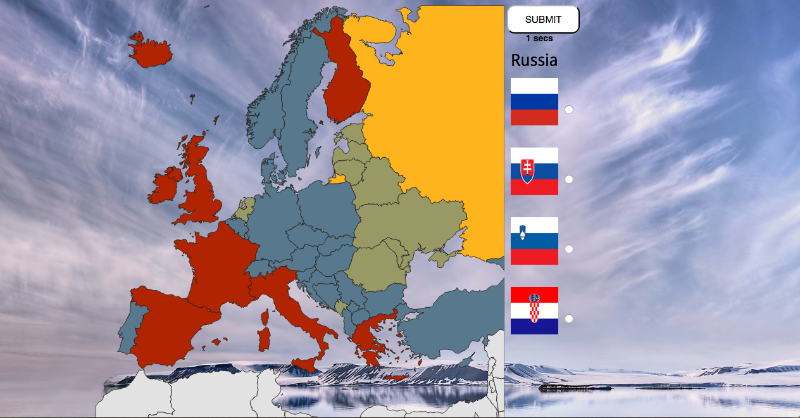

# European Flags Trivia Game

This game tests how well individuals know european countries and their respective flags. Click on a country and guess
what flag belongs to the selected country in 30 seconds. 

The game was built mainly using an svg library (Raphael JS) to generate the map and jquery functionality 
to make the questions.

Below is a code snippet for the 30 second timer.

     var count=30;

     var counter=setInterval(timer, 1000);

     function timer()
     {
     count=count-1;
     if (count <= 0)
     {
     clearInterval(counter);
     alert('time up!!')
     return;
     }

     document.getElementById("timer").innerHTML=count + " secs";
     }

Here is a preview the game.

     
